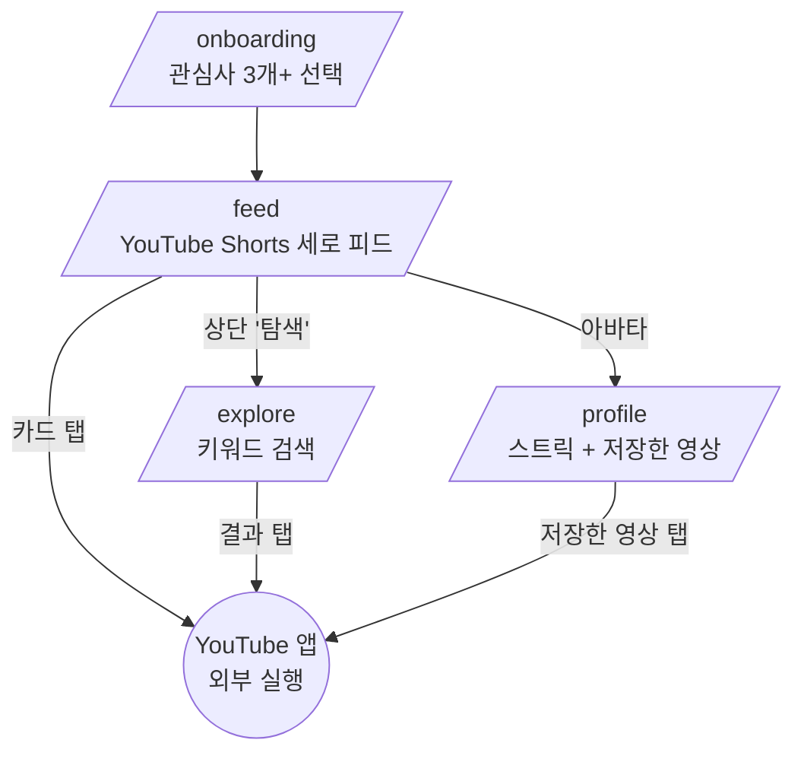
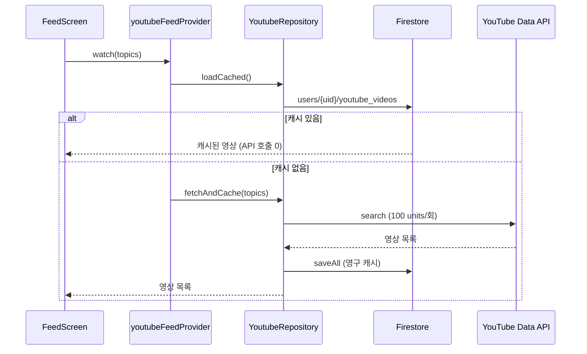

# 아키텍처

## 레이어 구조

```
presentation/  ← Flutter UI (ConsumerWidget)
     │  watch/read
     ▼
domain/        ← Riverpod Provider (상태/유즈케이스)
     │  ref.read(repo)
     ▼
data/repositories/  ← Firestore + 외부 API 조합, 캐싱 정책
     │
     ├── data/services/   ← 순수 외부 API 호출 (YouTube Data API v3)
     └── data/models/     ← 도메인 모델 (YoutubeVideo)
```

원칙: **단방향 의존**. presentation은 domain만, domain은 repository만 안다.
Repository가 "Firestore 캐시 우선, 없으면 API 조회" 정책의 단일 경계.

## 화면 흐름



## 데이터 흐름 (피드 예시)



## 핵심 컴포넌트

| 영역 | 파일 | 책임 |
|------|------|------|
| 라우팅 | `core/router.dart` | go_router 선언형 라우트 4개 |
| 외부 실행 | `core/youtube_launcher.dart` | `vnd.youtube://` → 웹 폴백 (공통) |
| 피드 | `presentation/feed/` | Shorts PageView + 썸네일 위젯 |
| 탐색 | `presentation/explore/` | 키워드 검색 (캐시 안 함) |
| 프로필 | `presentation/profile/` | 스트릭 카드 + 북마크 목록 |
| 공통 UI | `presentation/common/video_list_tile.dart` | explore/profile 공유 타일 |
| 캐싱 | `data/repositories/youtube_repository.dart` | 피드 캐시, 검색 비캐시 |
| 스트릭 | `data/repositories/streak_repository.dart` | 연속 학습일 (clock 주입) |

## 상태관리 (Riverpod)

- `youtubeFeedProvider` — `FutureProvider.family<List, List<String>>` (캐시 우선)
- `youtubeVideosProvider` — `StateProvider` (피드 내 북마크 로컬 반영)
- `searchResultsProvider` — `FutureProvider.family<List, String>` (빈 쿼리 가드)
- `bookmarkedVideosProvider` — `FutureProvider` (북마크 필터)
- `streakProvider` — `FutureProvider` (진입 시 활동 기록)
- `selectedTopicsProvider` — `NotifierProvider<Set<String>>` (관심사)

## 주요 결정 기록

[ADR 디렉터리](../.planning/decisions/) 참조:
- ADR-0001 Flutter 채택
- ADR-0002 Firebase (Auth + Firestore)
- ADR-0003 Cloud Functions 미사용
- ADR-0004 Gemini 카드 → YouTube Shorts 피드 전환
- ADR-0005 WebView 임베드 대신 url_launcher
